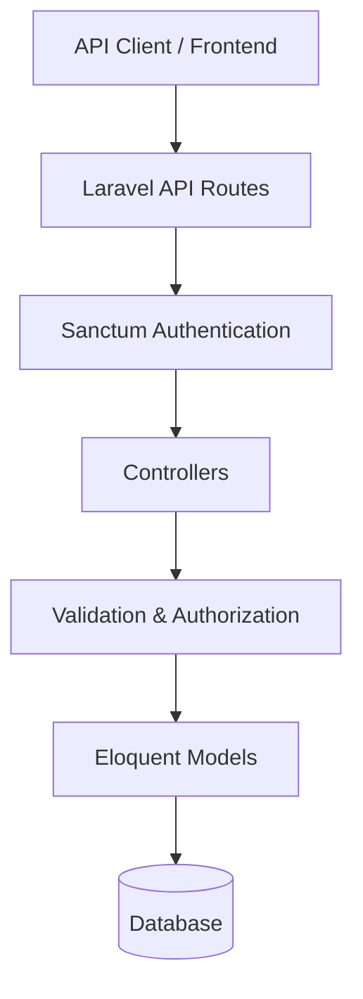

# ChainVault

ChainVault is a Laravel-based investment management REST API built as a portfolio project to demonstrate secure backend development, authentication, authorization, validation, database-backed CRUD operations, business rules, and automated testing.

## Overview

ChainVault provides APIs for managing investment opportunities and investment applications.

### Core modules

- **Authentication** — registration, login, logout, and authenticated-user access using Laravel Sanctum.
- **Investment Opportunities** — create, list, view, update, and delete investment opportunities.
- **Investment Applications** — create, list, view, update, and delete applications with validation, duplicate protection, and ownership authorization.

## Key Features

### Authentication
- User registration
- User login
- Sanctum bearer-token authentication
- Authenticated profile endpoint
- Logout with current-token invalidation
- Protected API routes

### Investment Opportunities
- Create opportunities
- List opportunities
- View an individual opportunity
- Update opportunities
- Delete opportunities
- Validation and investment-status handling

### Investment Applications
- Create applications
- List applications
- View individual applications
- Update applications
- Delete applications
- Prevent duplicate applications for the same opportunity
- Validate amount and status
- Ownership-based authorization
- `403 Forbidden` for unauthorized ownership access
- `422 Unprocessable Entity` for invalid input
- `409 Conflict` for duplicate applications

## Tech Stack

- PHP
- Laravel
- Laravel Sanctum
- Eloquent ORM
- MySQL / relational database
- REST API
- PHPUnit / Laravel Feature Tests
- Git & GitHub

## Architecture



### Request flow

```text
API Client
   ↓
Laravel API Route
   ↓
Sanctum Authentication
   ↓
Controller
   ↓
Validation / Authorization
   ↓
Eloquent Model
   ↓
Database
   ↓
JSON Response
```

## API Endpoints

### Authentication

| Method | Endpoint | Description | Auth |
|---|---|---|---|
| POST | `/api/register` | Register a user | No |
| POST | `/api/login` | Login and receive token | No |
| POST | `/api/logout` | Revoke current token | Yes |
| GET | `/api/user` | Get authenticated user | Yes |

### Investment Opportunities

| Method | Endpoint | Description | Auth |
|---|---|---|---|
| GET | `/api/investment-opportunities` | List opportunities | Yes |
| POST | `/api/investment-opportunities` | Create opportunity | Yes |
| GET | `/api/investment-opportunities/{id}` | View opportunity | Yes |
| PUT/PATCH | `/api/investment-opportunities/{id}` | Update opportunity | Yes |
| DELETE | `/api/investment-opportunities/{id}` | Delete opportunity | Yes |

### Investment Applications

| Method | Endpoint | Description | Auth |
|---|---|---|---|
| GET | `/api/investment-applications` | List applications | Yes |
| POST | `/api/investment-applications` | Create application | Yes |
| GET | `/api/investment-applications/{id}` | View application | Yes |
| PUT/PATCH | `/api/investment-applications/{id}` | Update application | Yes |
| DELETE | `/api/investment-applications/{id}` | Delete application | Yes |

Protected endpoints use:

```http
Authorization: Bearer YOUR_TOKEN
```

## Example Request

### Create an investment application

```json
{
  "investment_opportunity_id": 1,
  "amount": 1000,
  "notes": "Initial investment application"
}
```

### Update an application

```json
{
  "amount": 2500,
  "status": "approved",
  "notes": "Updated application"
}
```

Valid application statuses:

```text
pending
approved
rejected
```

## HTTP Status Codes

| Status | Meaning |
|---|---|
| `200` | Successful request |
| `201` | Resource created |
| `401` | Authentication required/failed |
| `403` | Authenticated but not authorized |
| `404` | Resource not found |
| `409` | Conflict, such as duplicate application |
| `422` | Validation failed |

## Authorization

Investment applications use ownership checks.

A user can update or delete only their own application.

```text
User A → User A application → Allowed
User A → User B application → 403 Forbidden
```

This prevents an authenticated user from modifying another user's application by simply knowing its ID.

## Validation

Important fields are validated before requests are processed.

Examples:

- `investment_opportunity_id` is required and must reference an opportunity.
- `amount` must be numeric and greater than `0`.
- `status` must be `pending`, `approved`, or `rejected`.
- Required fields cannot be omitted.

Invalid requests return `422 Unprocessable Entity`.

## Duplicate Application Protection

A user cannot submit multiple applications for the same investment opportunity.

A duplicate submission returns:

```text
409 Conflict
```

This demonstrates business-rule enforcement beyond basic CRUD.

## Testing

The current automated test suite contains:

**17 passing tests**

Coverage includes:

- User registration
- User login
- Authenticated profile access
- Unauthenticated profile protection
- Logout
- Investment application creation
- Investment application update
- Application ownership protection
- Application deletion protection
- Required-field validation
- Duplicate application protection
- Unauthenticated application protection
- Invalid application input
- Investment opportunity creation
- Investment opportunity listing
- Investment opportunity retrieval
- Investment opportunity update
- Investment opportunity deletion

Run the suite with:

```bash
php artisan test
```

## Local Setup

### 1. Clone the repository

```bash
git clone YOUR_REPOSITORY_URL
cd ChainVault
```

### 2. Install dependencies

```bash
composer install
```

### 3. Create the environment file

Windows PowerShell:

```powershell
Copy-Item .env.example .env
```

Or:

```bash
cp .env.example .env
```

### 4. Generate the application key

```bash
php artisan key:generate
```

### 5. Configure the database

Update `.env` with your local database settings:

```env
DB_CONNECTION=mysql
DB_HOST=127.0.0.1
DB_PORT=3306
DB_DATABASE=chainvault
DB_USERNAME=root
DB_PASSWORD=
```

### 6. Run migrations

```bash
php artisan migrate
```

### 7. Start the server

```bash
php artisan serve
```

The local API will normally be available at:

```text
http://127.0.0.1:8000
```

## Project Structure

```text
ChainVault/
├── app/
│   ├── Http/
│   │   └── Controllers/
│   └── Models/
├── database/
│   ├── factories/
│   └── migrations/
├── routes/
│   └── api.php
├── tests/
│   ├── Feature/
│   └── Unit/
├── .env.example
├── .gitignore
├── artisan
├── composer.json
└── README.md
```

## Security Notes

This is a portfolio project and is not presented as a production financial platform.

Never commit:

- `.env`
- production credentials
- database passwords
- API keys
- Sanctum tokens
- other private secrets

For deployment, configure environment variables securely and disable application debugging in production.

## What This Project Demonstrates

- REST API design
- Laravel MVC structure
- Sanctum authentication
- Authorization and resource ownership
- Eloquent ORM
- Request validation
- Business-rule enforcement
- Database-backed CRUD
- Automated Feature testing
- Appropriate HTTP status codes
- API security considerations
- Git/GitHub project organization

## Future Improvements

Possible future additions:

- Role-based access control
- Admin management
- Pagination and filtering
- Search
- Portfolio dashboard
- Payment/transaction integration
- Notifications
- API rate limiting
- OpenAPI/Swagger documentation
- CI/CD
- Production deployment

## Portfolio Note

ChainVault was built as a backend portfolio project to demonstrate practical Laravel API engineering.

The focus is on **clean API architecture, authentication, authorization, validation, business rules, security, and testable backend logic**.

## Author

**Luciana Okorie**  
Software & Web Developer

- GitHub: https://github.com/Luciana-Okorie
- LinkedIn: https://www.linkedin.com/in/luciana-okorie
